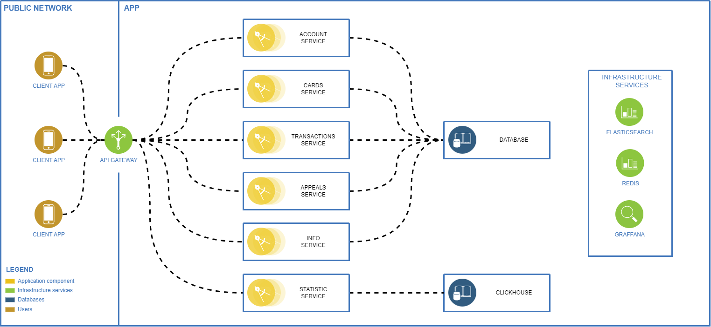

# **Задача**
На основе предоставленной навигационной схемы приложения для работы с корпоративными картами разработать API.
Система не должна быть интегрирована ни с какими внешними продуктами, разработка ведется целиком с нуля, внешние данные импортируются сразу в БД.

## **Навигационная схема:**
https://www.dropbox.com/s/22ps1w1j5uou6rp/sber_corp_proto_v1.1.pdf?dl=0

Считаю, что решение данной задачи должно быть более комплексным, поэтому дополнительно выполнил разработку диаграмм архитектуры и самой БД. Для каждого пункта оставил описание, почему было принято то или иное решение.

## **Диаграмма архитектуры:**

Предлагаю использовать в качестве архитектуры распределенный монолит, с разделением обязаностей на раздельные сервисы, так как по условиям задачи данные приходят в БД извне и для избегания связности между базами данных для каждого микросервиса придется делать отдельный сервис корректно импортирующий данные, либо производить изменения в логике получения данных извне. Для сбора оценок использовать сервис статиски, который хранит данные в ClickHouse, так как он ориентирован на чтение данных, что ускорит процесс сбора аналитики и для дальнейшего масштабирования функционала. 

В связи с нехваткой данных об инфраструктуре компании не прибегал к использованию докернизации, но при необходимости возможно произвести развертывание архитектуры с использованием Cubernetes и выносом некоторых сервисов в отдельные контейнеры с последующей балансировкой нагрузки без внесения изменений в саму архитектуру.

Для отображения статистики предлагаю использовать Graffana, для логирования использовать ElasticSearch, кэш хранить в Redis. В рамках задачи сказано, что система не должна быть интегрирована с внешними продуктами, а данные сервисы можно развернуть непосредственно вместе с системой избегая использования их как Saas.

## **Диаграмма БД:**
### **Основная БД**


Было решено для сущности обращений реализовать мастер таблицу `requests` и 2 таблицы `transaction_reqests` и `card_requests` хранящих дополнительную связность для различных типов обращений:
- по карте;
- по транзакции.
- общие (когда нельзя однозначно определить к какому из выше перечисленных типов можно отнести обращение, в данном случае никаких дополнительных связностей не нужно иметь, поэтому такие обращения могут спокойно храниться в мастер таблице).

Для таблиц `cards` и `transactions` было решено вынести тип валюты в отдельную таблицу, а все данные связанные с цифрами хранить в вещественных числах в отличии от реализации, где эти данные хранились бы как строковые литералы. Это позволит при расширении функционала, такого как добавление возможности совершать операции в приложении, избежать дополнительных изменений в структуре БД.

Также в таблице `cards` есть поле `user_name` вместо ссылки на пользователя. Это было сделано, так как в реквизитах карты может быть различное написание ФИО владельца. (Личный кейс, у меня 2 карты с разным написанием имени Nikolai, Nikolay)

Таблица `bank_info` хранит информацию, предоставляемую банком. Как пример на основе навигационной схемы: на главном экране приложения есть информация от банка
```
Действуют ограничения на снятие наличных по корпоративным картам: 170 000 рублей в день или 5 000 000 рублей в месяц.
```
Конечно лучшим вариантом было бы воспользоваться сервисом наподобие Firebase, но так как взаимодействие с сервисом извне происходит посредством обновления данных в бд, считаю что предоставление возможности обновлять информацию в реальном времени более релевантно также через бд.

**Дополнительная индексация**
Предлагаю: 
- Для таблицы `cards` добавить индекс для поля `user_id`;
- Для таблицы `transactions` добавить индекс для поля `card_id`;
- Для таблицы `requests` добавить индекс для поля `user_id`;

### **БД для статистики**


Таблица `feedback` хранит в себе `id` пользователя, чтобы можно было при необходимости получить из основной БД информацию о пользователе.
 
## **Документация API:**

API должно быть stateless и придерживаться концепции RESTful. Поэтому эндпоинты были выполненны в данном архитектурном дизайне.

API возвращает JSON ответ в формате:
```
{
  "status_code" int,
  "response": 
  {
    ...
  }
}
```
В поле `response` будет сущность, сообщение о выполнении операции либо об ошибке.

### **Account**
#### **[POST] LOGIN**
##### **URL:** 
```
https://{host}/api/{api_version}/users/login
```

##### **Описание:**
Авторизация пользователя по логину и паролю. Если авторизация прошла успешно возвращает ***access_token*** пользователя.

##### **Параметры:**
```
{
  "login": string,
  "password": string
}
```

##### **Пример использования:**
```
curl -X 'POST' \
  'https://{host}/api/{api_version}/users/login' \
  -H 'accept: application/json' \
  -H 'Content-Type: application/json' \
  -H 'access_token: {user_access_token} \
  -d '{
    "login": "{user_login}",
    "password": "{user_password}"
  }'
```

##### **Результат:**
`access_token` пользователя.
```
{
  "status_code": int,
  "response": 
  {
    "access_token": string
  }
}
```

#### **[POST] RECOVERY**
##### **URL:** 
```
https://{host}/api/{api_version}/users/recovery
```

##### **Описание:**
В случае невозможности авторизироваться в системе пользователь может пройти процедуру восстановления аккаунта.

##### **Параметры:**
```
{
  "login": string,
  "name": string,
  "birthday": string,
  "text": string
}
```

##### **Пример использования:**
```
curl -X 'POST' \
  'https://{host}/api/{api_version}/users/login' \
  -H 'accept: application/json' \
  -H 'Content-Type: application/json' \
  -H 'access_token: {user_access_token} \
  -d '{
    "login": "{user_login}",
    "name": "{user_full_name}",
    "birthday": "{user_date_of_birth}",
    "text": "{user_text}"
  }'
```

##### **Результат:**
Сообщение о выполнении операции.
```
{
  "status_code": int,
  "response": 
  {
    "message": string
  }
}
```
#### **[GET] LOGOUT**
##### **URL:**
```
https://{host}/api/{api_version}/users/{user_id}/logout
```

##### **Описание:**
Производит выход пользователя из системы.

##### **Параметры:**
**В `Header` запроса нужно добавить `access_token` пользователя** 

##### **Пример использования:**
```
curl -X 'GET' \
  'https://{host}/api/{api_version}/users/{user_id}/logout' \
  -H 'accept: application/json' \
  -H 'access_token: {user_access_token} 
```
  
##### **Результат:**
Сообщение о выполнении операции.
```
{
  "status_code": int,
  "response": 
  {
    "message": string
  }
}
```

#### **[GET] REFRESH TOKEN**
##### **URL:**
```
https://{host}/api/{api_version}/users/{user_id}/refresh
```

##### **Описание:**
Обновляет время жизни `access_token`. Если обновление прошло успешно возвращает обновленный ***access_token*** пользователя.

##### **Параметры:**
**В `Header` запроса нужно добавить `access_token` пользователя** 

##### **Пример использования:**
```
curl -X 'GET' \
  'https://{host}/api/{api_version}/users/{user_id}/refresh' \
  -H 'accept: application/json' \
  -H 'access_token: {user_access_token} 
```
  
##### **Результат:**
Возвращает обновленный `access_token`.
```
{
  "status_code": int,
  "response": 
  {
    "access_token": string
  }
}
```

#### **[GET] USER**
##### **URL:** 
```
https://{host}/api/{api_version}/users/{user_id}
```

##### **Описание:**
Получение данных пользователя.

##### **Параметры:**
**В `Header` запроса нужно добавить `access_token` пользователя** 

##### **Пример использования:**
```
curl -X 'GET' \
  'https://{host}/api/{api_version}/users/{user_id}' \
  -H 'accept: application/json' \
  -H 'access_token: {user_access_token} 
```
  
##### **Результат:**
Данныe пользователя.
```
{
  "status_code": int,
  "response":
  {
    "id": int,
    "name": string
  }
}
```

### **Cards**
#### **[GET] CARDS**
##### **URL:** 
```
https://{host}/api/{api_version}/users/{user_id}/cards
```

##### **Описание:**
Получение списка карт пользователя.

##### **Параметры:**
**В `Header` запроса нужно добавить `access_token` пользователя** 

##### **Пример использования:**
```
curl -X 'GET' \
  'https://{host}/api/{api_version}/users/{user_id}/cards' \
  -H 'accept: application/json' \
  -H 'access_token: {user_access_token} 
```
  
##### **Результат:**
Список карт пользователя.
```
{
  "status_code": int,
  "response":
  [
    {
      "id": integer,
      "number": string,
      "user_name": string,
      "limit": double,
      "withdrawal_limit": double,
      "purchase_limit": double,
      "currency": string,
      "status": string,
    },
    ...
    {
      "id": integer,
      "number": string,
      "user_name": string,
      "limit": double,
      "withdrawal_limit": double,
      "purchase_limit": double,
      "currency": string,
      "status": string
    }
  ]
}
```

#### **[GET] CARD**
##### **URL:** 
```
https://{host}/api/{api_version}/users/{user_id}/cards/{card_id}
```

##### **Описание:**
Получение данных карты пользователя.

##### **Параметры:**
**В `Header` запроса нужно добавить `access_token` пользователя** 

##### **Пример использования:**
```
curl -X 'GET' \
  'https://{host}/api/{api_version}/users/{user_id}/cards/{card_id}' \
  -H 'accept: application/json' \
  -H 'access_token: {user_access_token} 
```
  
##### **Результат:**
Данные по карте пользователя.
```
{
  "status_code": int,
  "response": 
  {
    "id": integer,
    "number": string,
    "user_name": string,
    "limit": double,
    "withdrawal_limit": double,
    "purchase_limit": double,
    "currency": string,
    "status": string,
  }
}
```

### **Transactions**
#### **[GET] TRANSACTIONS**
##### **URL:** 
```
https://{host}/api/{api_version}/users/{user_id}/cards/{card_id}/transactions
```

##### **Описание:**
Получение списка транзакций по карте пользователя.

##### **Параметры:**
**В `Header` запроса нужно добавить `access_token` пользователя** 

##### **Пример использования:**
```
curl -X 'GET' \
  'https://{host}/api/{api_version}/users/{user_id}/cards/{card_id}/transactions' \
  -H 'accept: application/json' \
  -H 'access_token: {user_access_token} 
```
  
##### **Результат:**
Список транзакций по карте пользователя.
```
{
  "status_code": int,
  "response":
  [ 
    {
      "id": int,
      "name": string,
      "created_at": string,
      "amount": double,
      "currency": string,
      "card_name": string,
      "type": string
    },
    ... 
    {
      "id": int,
      "name": string,
      "created_at": string,
      "amount": double,
      "currency": string,
      "card_name": string,
      "type": string
    }
  ]
}
```

#### **[GET] TRANSACTION**
##### **URL:** 
```
https://{host}/api/{api_version}/users/{user_id}/cards/{card_id}/transactions/{transaction_id}
```

##### **Описание:**
Получение данных по транзакции у карты пользователя.

##### **Параметры:**
**В `Header` запроса нужно добавить `access_token` пользователя** 

##### **Пример использования:**
```
curl -X 'GET' \
  'https://{host}/api/{api_version}/users/{user_id}/cards/{card_id}/transactions/{transaction_id}' \
  -H 'accept: application/json' \
  -H 'access_token: {user_access_token} 
```
  
##### **Результат:**
Данные по транзакции у карты пользователя.
```
{
  "status_code": int,
  "response":
  {
    "id": int,
    "name": string,
    "created_at": string,
    "amount": double,
    "currency": string,
    "card_name": string,
    "type": string
  }
}
```

### **Requests**
#### **[GET] REQUESTS**
##### **URL:** 
```
https://{host}/api/{api_version}/users/{user_id}/requests
```

##### **Описание:**
Получение списка обращений пользователя.

##### **Параметры:**
**В `Header` запроса нужно добавить `access_token` пользователя** 

##### **Пример использования:**
```
curl -X 'GET' \
  'https://{host}/api/{api_version}/users/{user_id}/requests' \
  -H 'accept: application/json' \
  -H 'access_token: {user_access_token} 
```
  
##### **Результат:**
Список обращений пользователя сгруппированных по категориям.
```
{
  "status_code": int,
  "response":
  {
    "user requests":
    [ 
      {
        "id": int,
        "created_at": string,
        "text": string,
        "status": string
      },
      ... 
      {
        "id": int,
        "created_at": string,
        "text": string,
        "status": string
      }
    ],
    "card requests":
    [
      {
        "id": int,
        "card_id": int,
        "created_at": string,
        "text": string,
        "status": string
      },
      ... 
      {
        "id": int,
        "card_id": int,
        "created_at": string,,
        "text": string,
        "status": string
      }
    ],
    "transaction requests":
    [
      {
        "id": int,
        "transaction_id": int,
        "created_at": string,
        "text": string,
        "status": string
      },
      ...
      {
        "id": int,
        "transaction_id": int,
        "created_at": string,
        "text": string,
        "status": string
      }
    ]
  }
}
```

#### **[POST] ADD USER REQUEST**
##### **URL:** 
```
https://{host}/api/{api_version}/users/{user_id}/requests
```

##### **Описание:**
Создание нового запроса для карты пользователя.

##### **Параметры:**
**В `Header` запроса нужно добавить `access_token` пользователя** 
```
{
  "text": string
}
```

##### **Пример использования:**
```
curl -X 'POST' \
  'https://{host}/api/{api_version}/users/{user_id}/requests' \
  -H 'accept: application/json' \
  -H 'Content-Type: application/json' \
  -H 'access_token: {user_access_token} \
  -d '{
    "text": "{user_text}"
  }'
```

##### **Результат:**
Данные о созданном обращении.
```
{
  "status_code": int,
  "response": 
  {
    "id": int,
    "created_at": string,
    "text": string,
    "status": string
  }
}
```

#### **[POST] ADD CARD REQUEST**
##### **URL:** 
```
https://{host}/api/{api_version}/users/{user_id}/cards/{card_id}/requests
```

##### **Описание:**
Создание нового запроса для карты пользователя.

##### **Параметры:**
**В `Header` запроса нужно добавить `access_token` пользователя** 
```
{
  "text": string
}
```

##### **Пример использования:**
```
curl -X 'POST' \
  'https://{host}/api/{api_version}/users/{user_id}/cards/{card_id}/requests' \
  -H 'accept: application/json' \
  -H 'Content-Type: application/json' \
  -H 'access_token: {user_access_token} \
  -d '{
    "text": "{user_text}"
  }'
```

##### **Результат:**
Данные о созданном обращении.
```
{
  "status_code": int,
  "response": 
  {
    "id": int,
    "card_id": int,
    "created_at": string,
    "text": string,
    "status": string
  }
}
```

#### **[POST] ADD TRANSACTION REQUEST**
##### **URL:** 
```
https://{host}/api/{api_version}/users/{user_id}/cards/{card_id}/transactions/{transaction_id}/requests
```

##### **Описание:**
Создание нового запроса для транзакции по карте пользователя.

##### **Параметры:**
**В `Header` запроса нужно добавить `access_token` пользователя** 
```
{
  "text": string
}
```

##### **Пример использования:**
```
curl -X 'POST' \
  'https://{host}/api/{api_version}/users/{user_id}/cards/{card_id}/transactions/{transaction_id}/requests' \
  -H 'accept: application/json' \
  -H 'Content-Type: application/json' \
  -H 'access_token: {user_access_token} \
  -d '{
    "text": "{user_text}"
  }'
```

##### **Результат:**
Данные о созданном обращении.
```
{
  "status_code": int,
  "response": 
  {
    "id": int,
    "transaction_id": int,
    "created_at": string,
    "text": string,
    "status": string
  }
}
```

### **Statistic**
#### **[POST] FEEDBACK**
##### **URL:** 
```
https://{host}/api/{api_version}/users/{user_id}/feedback
```

##### **Описание:**
Создание нового отзыва о приложении от пользователя.

##### **Параметры:**
**В `Header` запроса нужно добавить `access_token` пользователя** 
```
{
  "rating": int,
  "text": string
}
```

##### **Пример использования:**
```curl -X 'POST' \
  'https://{host}/api/{api_version}/users/{user_id}/feedback' \
  -H 'accept: application/json' \
  -H 'Content-Type: application/json' \
  -H 'access_token: {user_access_token} \
  -d '{
    "rating": int,
    "text": "{user_text}"
  }'
```

##### **Результат:**
Сообщение о выполнении операции.
```
{
  "status_code": int,
  "response":
  {
    "message": string
  }
}
```

### **Info**
#### **[GET] INFO**
##### **URL:** 
```
https://{host}/api/{api_version}/info/{info_block_name}
```

##### **Описание:**
Получение блока информации от банка.

##### **Параметры:**
**В `Header` запроса нужно добавить `access_token` пользователя** 

##### **Пример использования:**
```curl -X 'GET' \
  'https://{host}/api/{api_version}/info/{info_block_name}' \
  -H 'accept: application/json' \
  -H 'access_token: {user_access_token} \
```

##### **Результат:**
Текст блока информации.
```
{
  "status_code": int,
  "response":
  {
    "text": string
  }
}
```